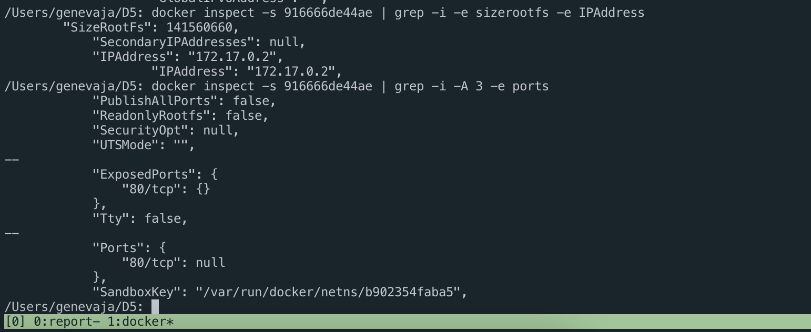

# D05\_SimpleDocker genevaja

## Part 1. Готовый докер
- Взятие официального докер образа с nginx и загрузка его при помощи docker pull
 
Для начала надо посмотреть, какие образы доступны в репозиториях docker. Это делается при помощи команды `docker search nginx`

Для работы мы берём официальный образ nginx и используем команду `docker pull nginx`

- Проверить наличие докер образа через `docker images`

- Запустить докер через `docker run -d [image_id|repository]`

Флаг -d для команды run запускает контейнер в фоновом режиме. После запуска выводится container ID

- Проверить, что докер запустился при помощи команды `docker ps`

По-умолчанию имена контейнерам назначаются автоматически. Используя флаг `-name=CONTAINER'S_NAME` можно назначать любое произвольное имя

- Посмотреть информацию о контейнере через `docker inspect [container_id|container_name]`

- По выводу команды опредедить размер контейнера, список портов и ip контейнера

Для того, чтобы отчёт inspect показывал в выводе размер контейнера его надо запускать с флагом -е `docker -e inspect [container_id|container_name]`
Размер контейнера: 141560660 В (135 МВ)
Список портов: 80/tcp
IP контейнера: 172.17.0.2

- Остановить докер образ через `docker stop [container_id|container_name]`

Для остановки контейнера не обязательно указывать container_id полностью. На скриншоте вывод двух команд `docker stop` и `docker ps`

- Запустить докер с назначенными портами 80 и 445 на локальную машину через команду run

Для запуска контейнера с назначенными портами используется флаг -p. Команда имеет следующий вид `docker run -p 80:80/tcp -p 443:443/tcp -d nginx`

- Перезапустить контейнер через `docker restart [container_id|container_name]

В случае успешного перезапуска STATUS обнуляется и отсчитывает с нуля

## Part 2. Операции с контейнером
- Прочитать конфигурационный файл nginx.conf внутри докер образа

Для вывода информации использовалась команда `docker exec CONT_ID cat /etc/nginx/nginx.conf`

- Создать файл nginx.conf и настроить в нём по пути /status отдачу страницы статуса сервера nginx

Настройки для отображения тех или иных страниц определяются директивой `server { location /PAGE {}}`. 
Локальные настройки для сервера складываются в папку /etc/nginx/conf.d, которая подключена директивой `include PATH` в основном файле конфигурации /etc/nginx/nginx.conf.
Для отображения страницы /status в файл /etc/nginx/conf.d/default.conf был добавлен блок `location /status { stub_status; }`. 

Используемые команды:

`docker cp CONT_NAME:/etc/nginx/conf.d/default.conf ./` - копирую файл с настройками по-умолчанию на локальную машину

`docker exec CONT_NAME rm /etc/nginx/conf.d/default.conf` - удаляю файл с настройками по-умолчанию в контейнере

`docker cp nginx.conf CONT_NAME:/etc/nginx/conf.d/nginx.conf` - копирую файл с добавленной директивой stub_status в /etc/nginx/conf.d/

`docker exec CONT_NAME nginx -s reload`

- Экспортировать контейнер в файл container.tar через команду `export`

- Остановить контейнер

- Удалить образ через `docker rmi [image_id], не удаляя перед этим контейнеры

Для удаления образа без удаления контейнера возможно с использованием флага `-f` (force).
`docker rmi -f nginx`

- Удалить остановленный контейнер

Для удаления контейнера использовал команду `docker rm -f CONT_NAME`

- Импортировать контейнер обратно через команду import, запустить контейнер и сервер

`cat container.tar | docker import - REPOSITORY_NAME:TAG` - Сначала считываем содержимое архива и перенаправляем вывод. REPOSITORY_NAME:TAG позволяет установить название для репозитория и тэг.

`docker run -it -d -p 80:80/tcp -p 443:443/tcp --name part2 [image_id] /bin/bash` - Запускаем контейнер с перенаправлением портов и оболочкой по-умолчанию

`docker exec part2 service nginx start` - запускаем nginx на сервере

- Проверить, что по адресу localhost:80/status отдаётся страничка со статусом сервера nginx

## Part 3. Мини веб-сервер

- Исходный код мини-сервера

- Содержимое файла nginx.conf

Так как стандартный файл `/etc/nginx/nginx.conf` включает в себя диррективу подключения папки `/etc/nginx/conf.d/` я дописал модуль для упраления сервером без необходимости править стартовый файл.
* listen localhost 81 - указываем, по какому порту слушаем запрос
* location / - Определить URL для родительского сервера
* include fastcgi - подключаем модуль fastcgi
* Проксируем запрос, полученный на 81 порт на указанный адрес и номер порта

- Запуск fastcgi сервера
* `spawn-fcgi -a 127.0.0.1 -p 8080 -f ./a.out` - запуск сервера на ip 127.0.0.1 и 8080 порте. Флаг -f указывает file, который надо запустить
* После запуска ему присвается номер и процесс работает в фоновом режиме

- Запуск nginx
* Сервер запускается командой `sudo service nginx start`
* Измененные настройки применяются командой `nginx -s reload`

- 

## Part 4. Свой докер.

- Для запуска docker build и запуска контейнера написан скрипт `part.sh`
- Для остановки контейнера и удаления образа написан скрипт `stop_cont.sh`

## Part 5. Dockle

- Для установки Dockle воспользовался инструкцией из официального репозитория
- При первом запуске столкнулся со следующей ошибкой:
  
- Для решения проблемы пришлось использовать следующий метод:
  * Создал учётную запись на [Docker home page](https://www.docker.com)
  * Залогинился через терминал, используя команду `docker login`
  * Запушил образ `docker push REPOSITORY_NAME`
  * И только после этого запустил `dockle REPOSITORY_NAME`
- Вывод dockle после первой проверки образа

- Вывод dockle после добавления пользователя, от которого будет запускаться сервер:

## Part 6. Базовый Docker Compose

- Для выполнения задания требуется уствновить docker-compose
- Команда для запуска yml файла docker-compose build
- Для запуска готового образа используется команда docker-compose up -d (флаг -d для запуска в фоновом режиме)

